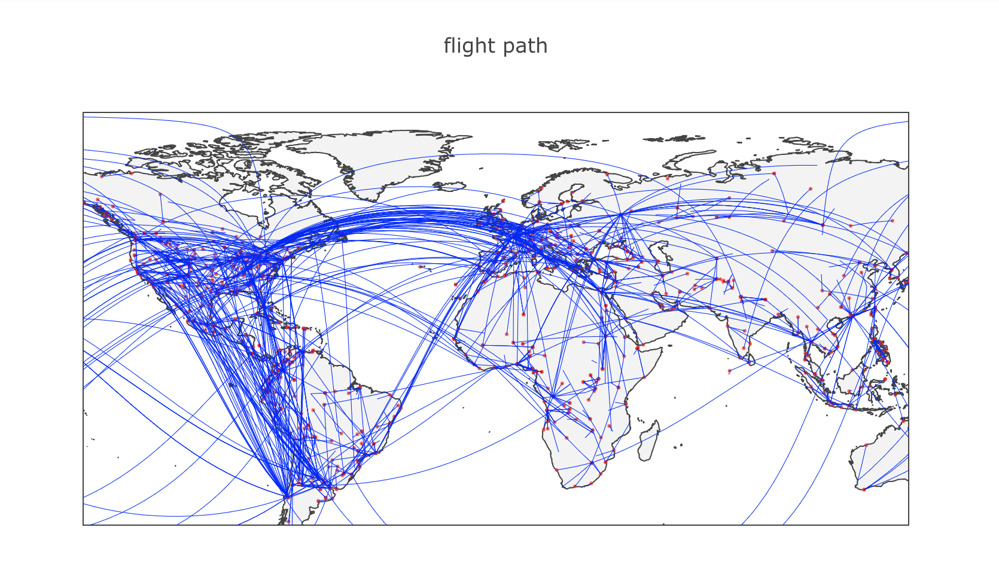

# Airplane crash

This is a route map of the air crash report about the air crashes in the past 70 years around the world.

## Flight path with air crashes

The process of plotting the map:

- `air-crash-map.ipynb` - Draw the airport station and routes.
- Data are curated from Socrata and World Cities Database from NGIA.

## Read full stories and make other charts

Please refer [here](https://dnnsociety.org/2018/04/30/flying-in-the-sky-a-report-of-air-crash-worldwide/.png).